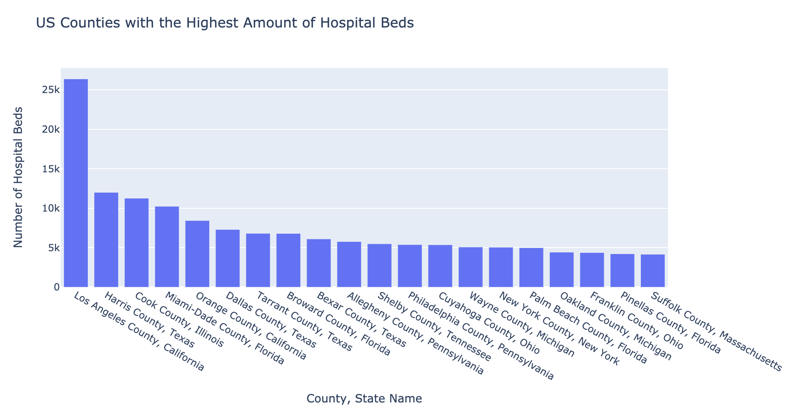

# COVID-19-Cases-VS-Beds

### Anticipating and Mitigating Future Problems Due to COVID-19
#### The Number of Staffed Hospital Beds in Los Angeles, California, may indicate that if COVID-19 were to spread there will not be enough beds for everyone who is sick.

This analysis observes the age of the population in US Counties. It is important to acknowledge these findings (i.e. population over 60, population 18 and under) because certain age groups are at risk of death if they develop COVID-19. In addition, these numbers can be used to determine which counties might be the most vulnerable to shortages of hospital beds if COVID-19 continues to spread.

8 out of 10 deaths due to COVID-19 in the US have been in adults 65 and older (CDC).

Los Angeles has the highest population ages 60 and over as seen below. 

Luckily, Los Angeles also has the highest number of hospital beds.

However, JHU COVID-19 Cases by County information shows us that there are 22,002 staffed hospital beds and 13,823 confirmed cases. 

This information may serve as a warning that potentially there will not be enough staffed beds to account for sick individuals if the virus continues to spread.

Counties that are most vulnerable to the virus, or, more specifically, deaths by the virus are those with the highest population of 60 and over. 

It would not be surprising if, like ventilators (NPR), there may be a shortage of staffed hospital beds. While counties like Los Angeles have the highest total number of hospital beds, they also have the highest populations at risk of death due to COVID-19. 

Bearing all this in mind, it is crucial to take whatever measures necessary to ensure any who need a staffed hospital bed has one available to them. 

#### Sources

[Johns Hopkins University COVID-19 US Cases By County](https://coronavirus.jhu.edu/us-map)

[CDC Coronavirus Disease](https://www.cdc.gov/coronavirus/2019-ncov/need-extra-precautions/older-adults.html)

[Ventilator Shortages Loom As States Ponder Rules For Rationing](https://www.npr.org/sections/health-shots/2020/04/03/826082727/ventilator-shortages-loom-as-states-ponder-rules-for-rationing)
